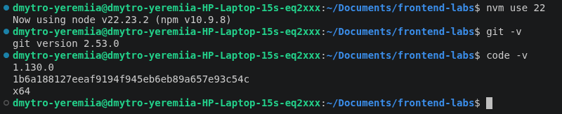
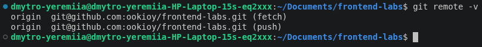

# Технічне завдання

## Лабораторна робота №1

### Назва

Налаштування робочого середовища

### Мета

Навчитись налаштовувати робоче середовище для розробки, використовувати git, створювати базові проєкти за допомогою React (Vite) та оформлювати звіти.

### Завдання

1. **Встановлення та оновлення програмного забезпечення:**
   - Встановити або оновити Node.js до останньої стабільної версії.
   - Встановити або оновити git до останньої стабільної версії.
   - Встановити або оновити обраний редактор коду (Visual Studio Code, WebStorm тощо).

**Результат:**

2. **Робота з репозиторієм:**
   - Клонувати репозиторій лабораторної роботи з наданого посилання.

**Результат:**   

3. **Створення React-проєкту:**
   - У клонованій директорії створити новий React-проєкт за допомогою [Vite](https://vitejs.dev/guide/), використовуючи назву "laba1".

4. **Оформлення звіту:**
   - Оформити звіт на локальному комп'ютері, роблячи commit після виконання кожного пункту завдання.

5. **Відправка роботи:**
   - Завантажити репозиторій з виконаною роботою у GitHub Classroom.
   - Додати посилання на звіт у Google Classroom.

### Результат

1. Проєкт у репозиторії GitHub, що містить:
   - React-проєкт із початковою структурою, створеною через Vite.
   - Історію комітів, що відображає послідовність виконання завдання.
2. Посилання на репозиторій у Google Classroom.

---

