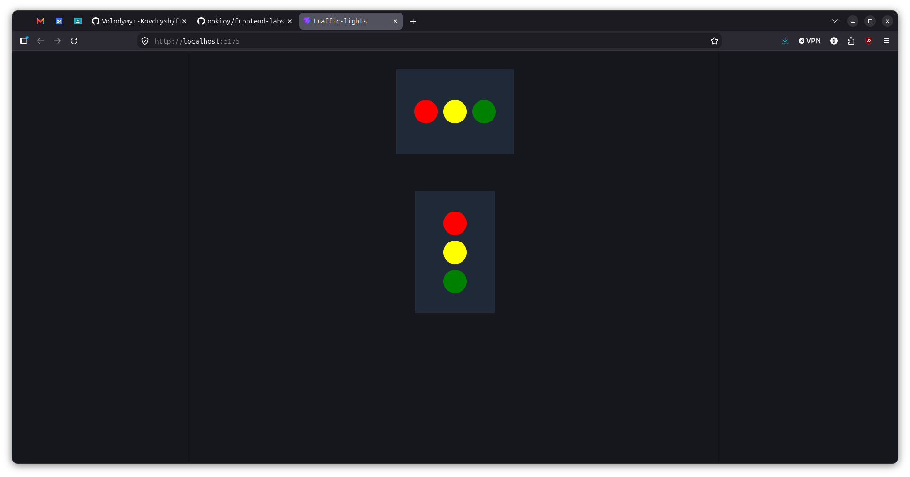

# Технічне завдання

## Лабораторна робота №2

### Назва

Початок роботи з React

### Мета

Навчитись створювати React-компоненти, передавати параметри через props, працювати з компонентами у вигляді окремих модулів та оформлювати звіти.

### Завдання

1. **Робота з репозиторієм:**
   - Клонувати репозиторій лабораторної роботи з наданого посилання.

2. **Створення React-проєкту:**
   - У клонованій директорії створити новий React-проєкт за допомогою [Vite](https://vitejs.dev/guide/#scaffolding-your-first-vite-project), використовуючи назву "traffic-lights".

3. **Розробка компонентів:**
   - **Компонента Light:**
     - Створити компоненту, яка приймає параметр `tlColor` через `props` (за замовчуванням `tlColor='red'`).
     - Використати бібліотеку `PropTypes` для типізації `props`.
     - Приклад:
       ```js
       import PropTypes from "prop-types";

       const Light = ({ tlColor = "red" }) => {
         return <div style={{ backgroundColor: tlColor, width: 50, height: 50, borderRadius: "50%" }}></div>;
       };

       Light.propTypes = {
         tlColor: PropTypes.string,
       };

       export default Light;
       ```
   - **Компонента TrafficLights:**
     - Створити компоненту, яка демонструє набір світлофорів, використовуючи компоненту `Light`.

4. **Демонстрація у `App`:**
   - У компоненті `App` продемонструвати два варіанти світлофорів:
     - Горизонтальний.
     - Вертикальний.

5. **Оформлення звіту:**
   - Оформити звіт на локальному комп'ютері, роблячи commit після виконання кожного пункту завдання.

6. **Відправка роботи:**
   - Завантажити репозиторій з виконаною роботою у GitHub Classroom.
   - Додати посилання на звіт у Google Classroom.

### Результат

1. **Проєкт у репозиторії GitHub:**
   - React-проєкт із створеними компонентами `Light` і `TrafficLights`.
   - Історія комітів, що відображає послідовність виконання завдання.

2. **Демонстрація:**
   - Компонент `App` демонструє горизонтальний та вертикальний варіанти світлофорів.

3. **Посилання на звіт у Google Classroom.** 

---

